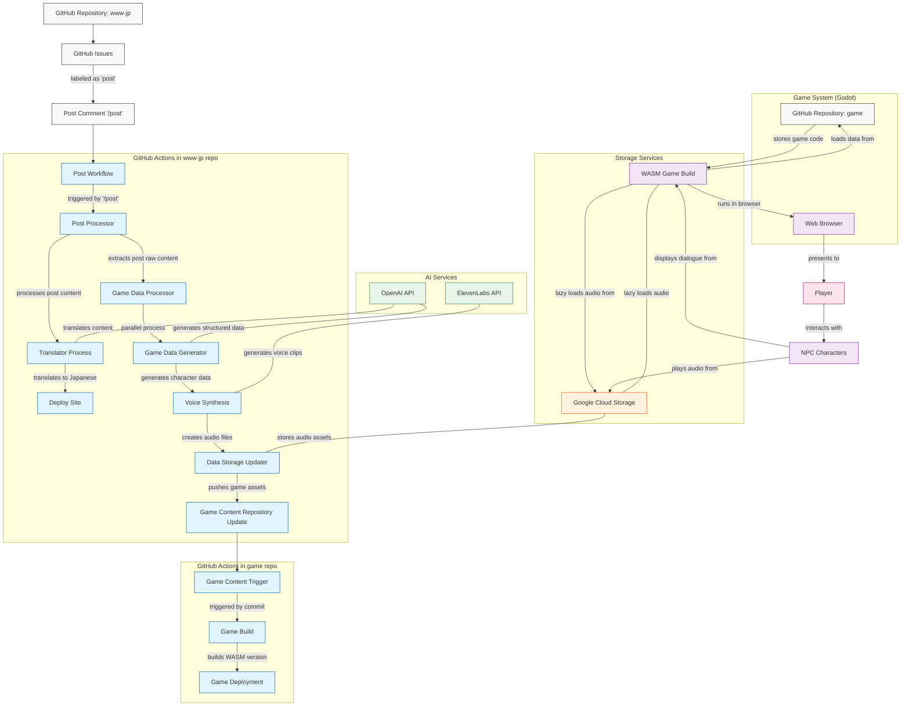

# Game Integration System Architecture

## Component Descriptions

### GitHub Components
- **GitHub Repository: www-jp**: Blog content repo with posts
- **GitHub Issues**: Used to create blog post content with "post" label
- **Post Comment**: Trigger ("/post") to initiate the workflow
- **GitHub Repository: game**: Separate repo containing Godot game code

### GitHub Actions (Workflows)
#### In www-jp repo:
- **Post Workflow**: Main workflow triggered by "/post" comment
- **Post Processor**: Processes issue content
- **Game Data Processor**: NEW - Extracts raw post data early in the process
- **Translator Process**: Translates content to Japanese using OpenAI
- **Deploy Site**: Deploys the updated blog with new content
- **Game Data Generator**: NEW - Converts raw post data to structured game data
- **Voice Synthesis**: NEW - Creates audio files from dialogue text
- **Data Storage Updater**: NEW - Updates GCS with audio assets
- **Game Content Repository Update**: NEW - Pushes game data to game repo

#### In game repo:
- **Game Content Trigger**: Triggered by content repo updates
- **Game Build**: Builds the Godot game to WASM
- **Game Deployment**: Deploys WASM build to web hosting

### AI Services
- **OpenAI API**: Used for translation and structured data generation
- **ElevenLabs API**: Used for voice synthesis from text

### Storage Services
- **Google Cloud Storage**: Stores generated audio assets for lazy loading

### Game System
- **WASM Game Build**: Browser-compatible build of the Godot game
- **Web Browser**: Platform where the game runs
- **NPC Characters**: In-game representations of blog authors

### User Interaction
- **Player**: End user interacting with the game
- **NPC Interaction**: Dialogue and behavior systems in the game

## Data Flow Sequence

1. Blog post is created via GitHub Issue with "post" label
2. "/post" comment triggers Post Workflow
3. Post Processor extracts raw post content
4. Game Data Processor takes the raw content (parallel to translation)
5. Game Data Generator creates structured JSON data for game:
   - Character traits and movement patterns
   - Dialogue options categorized by topic
   - Activity records
6. Voice Synthesis converts dialogue text to audio in both languages
7. Data Storage Updater:
   - Uploads audio files to Google Cloud Storage
   - Maintains references between text and audio assets
8. Game Content Repository Update:
   - Pushes JSON data and asset references to game repo
   - Triggers a webhook or workflow dispatch to game repo
9. Game Build process in game repo:
   - Triggered by content update
   - Builds Godot project to WASM 
   - Deploys to web hosting
10. Game in browser:
    - Loads character data directly from game code
    - Lazy loads audio assets from GCS as needed
11. Player interacts with NPCs representing blog authors

## Integration Points

### www-jp repo → game repo
- Structured JSON data for character attributes and dialogue
- Asset references for audio files in GCS
- Webhook or workflow_dispatch trigger for build

### GitHub Actions → AI Services
- Structured API calls with appropriate context and prompts
- Authentication using API keys stored as GitHub Secrets

### GitHub Actions → GCS
- Direct upload of audio files to Cloud Storage
- Generation of public URLs for game access

### Game → GCS
- Lazy loading of audio assets during gameplay
- Caching mechanisms for frequently accessed assets

### Game → Player
- Character behavior systems driven by generated data
- Dialogue UI with language selection
- Audio playback for immersive experience