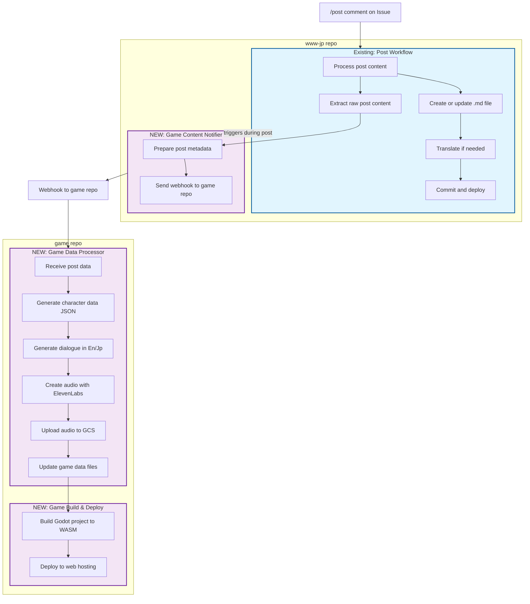

# GitHub Actions for Game Integration



## GitHub Actions to Create

### 1. Game Content Notifier (www-jp repo)
- **Trigger**: During the existing Post Workflow, after post content is available
- **Purpose**: Extract raw post data and notify game repo
- **Data Flow**: 
  1. Receives raw post content from Post Workflow
  2. Prepares minimally processed data (author, content, metadata)
  3. Sends webhook to game repo with post data
  4. No game-specific processing happens in this repo

- **Configuration**:
  ```yaml
  name: Game Content Notifier
  
  on:
    workflow_call:
      inputs:
        issue_number:
          required: true
          type: string
          
  jobs:
    notify-game-repo:
      runs-on: ubuntu-latest
      steps:
        - uses: actions/checkout@v4
        - name: Get post content
          id: get-content
          run: |
            POST_BODY=$(gh issue view ${{ inputs.issue_number }} --json body -q .body)
            POST_AUTHOR=$(gh issue view ${{ inputs.issue_number }} --json author -q .author.login)
            POST_TITLE=$(gh issue view ${{ inputs.issue_number }} --json title -q .title)
            POST_DATE=$(gh issue view ${{ inputs.issue_number }} --json createdAt -q .createdAt)
            
            # Create payload file
            cat > payload.json << EOF
            {
              "post_id": "${{ inputs.issue_number }}",
              "title": "$POST_TITLE",
              "author": "$POST_AUTHOR",
              "date": "$POST_DATE",
              "content": "$POST_BODY"
            }
            EOF
          env:
            GITHUB_TOKEN: ${{ secrets.GITHUB_TOKEN }}
        - name: Trigger game repo workflow
          run: |
            curl -X POST \
              -H "Authorization: token ${{ secrets.GAME_REPO_TOKEN }}" \
              -H "Accept: application/vnd.github.v3+json" \
              -d @payload.json \
              https://api.github.com/repos/yourusername/game/dispatches \
              -d '{"event_type": "new_post"}'
  ```

### 2. Game Data Processor (game repo)
- **Trigger**: Repository dispatch webhook from www-jp repo
- **Purpose**: Process post data into game-specific formats and generate audio
- **Data Flow**:
  1. Receives post data from www-jp repo webhook
  2. Uses OpenAI to analyze content and extract character traits
  3. Generates structured dialogue options in English and Japanese
  4. Creates audio files with ElevenLabs API
  5. Uploads audio files to Google Cloud Storage
  6. Updates game data files with new character information

- **Configuration**:
  ```yaml
  name: Game Data Processor
  
  on:
    repository_dispatch:
      types: [new_post]
          
  jobs:
    process-game-data:
      runs-on: ubuntu-latest
      steps:
        - uses: actions/checkout@v4
        - name: Setup Python
          uses: actions/setup-python@v5
          with:
            python-version: '3.10'
        - name: Install dependencies
          run: pip install -r scripts/requirements.txt
        - name: Extract post data
          id: extract-data
          run: |
            echo '${{ github.event.client_payload }}' > post_data.json
            POST_ID=$(jq -r '.post_id' post_data.json)
            POST_AUTHOR=$(jq -r '.author' post_data.json)
            echo "post_id=$POST_ID" >> $GITHUB_OUTPUT
            echo "post_author=$POST_AUTHOR" >> $GITHUB_OUTPUT
        - name: Generate game data
          run: python scripts/game-data-generator.py
          env:
            POST_DATA_FILE: post_data.json
            OPENAI_API_KEY: ${{ secrets.OPENAI_API_KEY }}
        - name: Generate audio
          run: python scripts/voice-synthesis.py
          env:
            ELEVENLABS_API_KEY: ${{ secrets.ELEVENLABS_API_KEY }}
            POST_ID: ${{ steps.extract-data.outputs.post_id }}
            POST_AUTHOR: ${{ steps.extract-data.outputs.post_author }}
        - name: Upload audio to GCS
          run: python scripts/gcs-uploader.py
          env:
            GCS_BUCKET: ${{ secrets.GCS_BUCKET }}
            GCS_CREDENTIALS: ${{ secrets.GCS_CREDENTIALS }}
            POST_ID: ${{ steps.extract-data.outputs.post_id }}
        - name: Update game data
          run: |
            mkdir -p data/characters/
            mkdir -p data/audio/
            cp generated/character-${{ steps.extract-data.outputs.post_id }}.json data/characters/
            cp generated/audio-refs-${{ steps.extract-data.outputs.post_id }}.json data/audio/
        - name: Commit changes
          run: |
            git config user.name "GitHub Actions"
            git config user.email "actions@github.com"
            git add data/characters/ data/audio/
            git commit -m "Add game data for post #${{ steps.extract-data.outputs.post_id }}"
            git push
  ```

### 3. Game Build & Deploy (game repo)
- **Trigger**: After Game Data Processor completes and commits changes
- **Purpose**: Build Godot project to WASM and deploy
- **Data Flow**:
  1. Triggered by commit to data directories
  2. Builds Godot project with updated character data
  3. Compiles to WASM for browser compatibility
  4. Deploys to web hosting

- **Configuration**:
  ```yaml
  name: Game Build & Deploy
  
  on:
    push:
      branches:
        - main
      paths:
        - 'data/characters/**'
        - 'data/audio/**'
          
  jobs:
    build-and-deploy:
      runs-on: ubuntu-latest
      steps:
        - uses: actions/checkout@v4
        - name: Setup Godot
          uses: chickensoft-games/setup-godot@v1
          with:
            version: 4.2.1
            export-templates: true
        - name: Build WASM
          run: |
            mkdir -p build/web
            godot --headless --export-release "Web" build/web/index.html
        - name: Deploy to hosting
          uses: cloudflare/wrangler-action@v3
          with:
            apiToken: ${{ secrets.CF_API_TOKEN }}
            accountId: ${{ secrets.CF_ACCOUNT_ID }}
            command: pages deploy build/web --project-name=game
  ```

## Action Steps in Existing Post Workflow

To integrate with the existing workflow, modify the Post Workflow to call the Game Content Notifier:

```yaml
# Add this to the existing Post Workflow
- name: Notify game repo
  if: steps.check-comment.outputs.valid == 'true'
  uses: ./.github/workflows/game-content-notifier.yaml
  with:
    issue_number: ${{ github.event.issue.number }}
  secrets: inherit
```

## Complete Data Flow Between Actions

1. **Issue Creation & Comment**
   - User creates GitHub issue with "post" label
   - User comments "/post" to trigger workflow

2. **Post Workflow** (existing, in www-jp repo)
   - Triggered by "/post" comment
   - Processes post content for blog
   - In parallel, calls Game Content Notifier with issue number

3. **Game Content Notifier** (new, in www-jp repo)
   - Extracts post content directly from GitHub issue
   - Packages raw post data with minimal processing
   - Sends repository dispatch webhook to game repo
   - No game-specific logic in this workflow

4. **Game Data Processor** (new, in game repo)
   - Triggered by repository dispatch webhook
   - Receives post data payload
   - Uses OpenAI to analyze content and generate character data
   - Creates dialogue in both English and Japanese
   - Generates audio files with ElevenLabs API
   - Uploads audio files to Google Cloud Storage
   - Updates game data files and commits changes

5. **Game Build & Deploy** (new, in game repo)
   - Triggered by commit to game data directories
   - Builds Godot project with updated character data
   - Compiles to WASM for browser compatibility
   - Deploys to web hosting (e.g., Cloudflare Pages)

6. **Game Runtime**
   - Loads character data from compiled game
   - Dynamically fetches audio files from GCS when needed
   - Presents NPCs with dialogue from blog posts

## Advantages of This Approach

1. **Clear Separation of Concerns**
   - Blog repo only handles blog content and notification
   - Game repo manages all game-specific data generation and processing

2. **Maintainability**
   - Game data structures can evolve independently
   - Audio generation parameters can be adjusted without touching blog repo
   - Game-specific code stays with game codebase

3. **Flexibility**
   - Game processing can be enhanced without modifying blog workflows
   - Additional game data sources could be added in the future